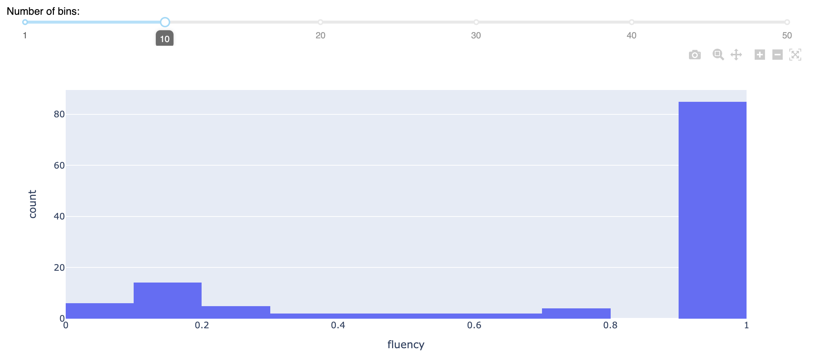

<div align="center">

# LangCheck ✅

Simple, Pythonic building blocks to evaluate LLM applications.

[Install](#install) •
[Examples](#examples) •
[Docs](#docs)  •
[日本語](README_ja.md)

</div>

## Install

```
pip install langcheck
```

## Examples

### Evaluate Text

Use LangCheck's suite of metrics to evaluate LLM-generated text.

```python
import langcheck

# Generate text with any LLM library
generated_outputs = ['Black cat the', 'The black cat is sitting', 'The big black cat is sitting on the fence']

# Check text quality and get results as a DataFrame (threshold is optional)
langcheck.eval.fluency(generated_outputs) > 0.5
```


It's easy to turn LangCheck metrics into unit tests, just use `assert`:

```python
assert langcheck.eval.fluency(generated_outputs) > 0.5
```

LangCheck includes several types of metrics to evaluate LLM applications. Some examples:

```python
# 1. Reference-Free Text Quality Metrics
langcheck.eval.toxicity(generated_outputs)
langcheck.eval.fluency(generated_outputs)
langcheck.eval.sentiment(generated_outputs)
langcheck.eval.flesch_kincaid_grade(generated_outputs)

# 2. Reference-Based Text Quality Metrics
langcheck.eval.factual_consistency(generated_outputs, reference_outputs)
langcheck.eval.semantic_sim(generated_outputs, reference_outputs)
langcheck.eval.rouge2(generated_outputs, reference_outputs)
langcheck.eval.exact_match(generated_outputs, reference_outputs)

# 3. Text Structure Metrics
langcheck.eval.is_int(generated_outputs, domain=range(1, 6))
langcheck.eval.is_float(generated_outputs, min=0, max=None)
langcheck.eval.is_json_array(generated_outputs)
langcheck.eval.is_json_object(generated_outputs)
langcheck.eval.contains_regex(generated_outputs, r"\d{5,}")
langcheck.eval.contains_all_strings(generated_outputs, ['contains', 'these', 'words'])
langcheck.eval.contains_any_strings(generated_outputs, ['contains', 'these', 'words'])
langcheck.eval.validation_fn(generated_outputs, lambda x: 'myKey' in json.loads(x))
```

### Visualize Metrics

LangCheck comes with built-in, interactive visualizations of metrics.

```python
# Choose some metrics
fluency_values = langcheck.eval.fluency(generated_outputs)
sentiment_values = langcheck.eval.sentiment(generated_outputs)

# Interactive scatter plot of one metric
langcheck.plot.scatter(sentiment_values)
```


```python
# Interactive scatter plot of two metrics
langcheck.plot.scatter(fluency_values, sentiment_values)
```


```python
# Interactive histogram of a single metric
langcheck.plot.histogram(fluency_values)
```




### Augment Data (coming soon)

```python
more_prompts = []
more_prompts += langcheck.augment.keyboard_typo(prompts)
more_prompts += langcheck.augment.ocr_typo(prompts)
more_prompts += langcheck.augment.synonym(prompts)
more_prompts += langcheck.augment.gender(prompts, to_gender='male')
more_prompts += langcheck.augment.gpt35_rewrite(prompts)
```

### Building Blocks for Monitoring

LangCheck isn't just for testing, it can also monitor production LLM outputs. Just save the outputs and pass them into LangCheck.

```python
from langcheck.utils import load_json

recorded_outputs = load_json('llm_output_logs_2023_10_02.json')
langcheck.eval.toxicity(recorded_outputs) < 0.25
langcheck.eval.is_json_array(recorded_outputs)
```

### Building Blocks for Guardrails

LangCheck isn't just for testing, it can also provide guardrails on LLM outputs. Just filter candidate outputs through LangCheck.

```python
raw_output = my_llm_application(random_user_prompt)
while langcheck.eval.contains_any_strings(raw_output, blacklist_words).all():
    raw_output = predict(random_user_prompt)
```

## Docs

Link to ReadTheDocs.
