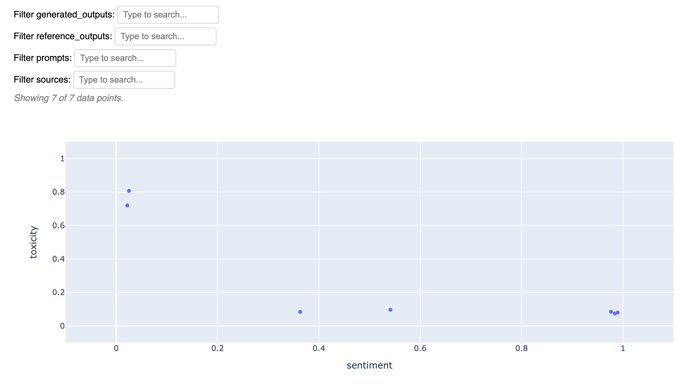

<div align="center">


LLMアプリケーションの評価のためのシンプルなPythonライブラリです。

[インストール](#インストール) •
[利用例](#利用例) •
[ドキュメント](https://langcheck.readthedocs.io/en/latest/index.html) •
[クイックスタート](https://langcheck.readthedocs.io/en/latest/quickstart.html) •
[English](README.md)

</div>

## インストール

```
pip install langcheck
```

## 利用例

### テキスト評価
様々な指標を使って、LLMの生成したテキストを評価することができます。


```python
from langcheck.metrics.ja import sentiment

# LLMを使って生成したテキストを入力する
generated_outputs = [
    'お役に立てて嬉しいです。',
    '質問に回答します。',
    'よくわかりません。自分で調べなさい。'
]

# テキストに含まれる感情表現を分析する(閾値に基づくテストも可能)
sentiment(generated_outputs) > 0.5
```


`assert`を使うことで、LangCheckの各指標を簡単にユニットテストに変換できます。

```python
assert sentiment(generated_outputs) > 0.5
```

LangCheckには、他にも以下のようなLLMアプリケーションを評価するための指標が含まれています。

```python
# 1. LLMのアウトプット単体での評価
# 有害表現分析
langcheck.metrics.ja.toxicity(generated_outputs)
# 文章表現の自然さの分析　
langcheck.metrics.ja.fluency(generated_outputs)
# 感情分析
langcheck.metrics.ja.sentiment(generated_outputs)

# 2. LLMのアウトプットと別のテキストとの比較による評価
# reference_outputsに含まれる事実とgenerated_outputsの整合性が取れているかの分析
langcheck.metrics.ja.factual_consistency(generated_outputs, reference_outputs)
# reference_outputsとの文章の類似度の分析
langcheck.metrics.ja.semantic_similarity(generated_outputs, reference_outputs)
langcheck.metrics.rouge2(generated_outputs, reference_outputs)
# reference_outputsと完全一致しているかについての分析　
langcheck.metrics.exact_match(generated_outputs, reference_outputs)

# 3. アウトプットの構造に関わる評価
# 正しい整数の形式になっているか？
langcheck.metrics.is_int(generated_outputs, domain=range(1, 6))
# 正しい小数の形式になっているか？
langcheck.metrics.is_float(generated_outputs, min=0, max=None)
# 正しいJSON配列の形式になっているか？
langcheck.metrics.is_json_array(generated_outputs)
# 正しいJSONオブジェクトの形式になっているか？
langcheck.metrics.is_json_object(generated_outputs)
# 正規表現とのマッチによる分析
langcheck.metrics.contains_regex(generated_outputs, r"\d{5,}")
# 指定された語を含むかどうかの分析
langcheck.metrics.contains_all_strings(generated_outputs, ['これらの', '単語を', '含む'])
langcheck.metrics.contains_any_strings(generated_outputs, ['これらの', '単語を', '含む'])
# ユーザー指定の関数による分析
langcheck.metrics.validation_fn(generated_outputs, lambda x: 'myKey' in json.loads(x))
```

いくつかの指標においては、OpenAI APIを使った評価手法がサポートされています。
これらの手法を使う際には、正しくAPI Keyが設定されていることを確認してください。
```python
import openai
from langcheck.metrics.ja import semantic_similarity

# https://platform.openai.com/account/api-keys
openai.api_key = YOUR_OPENAI_API_KEY

generated_outputs = ["猫が座っています。"]
reference_outputs = ["猫が座っていました。"]
eval_value = semantic_similarity(generated_outputs, reference_outputs, embedding_model_type='openai')
```

Azure OpenAIのAPIをお使いの場合、さらに必要なオプションが指定されていることを確認してください。
```python
import openai
from langcheck.metrics.ja import semantic_similarity

openai.api_type = 'azure'
openai.api_base = YOUR_AZURE_OPENAI_ENDPOINT
openai.api_version = YOUR_API_VERSION
openai.api_key = YOUR_OPENAI_API_KEY

generated_outputs = ["猫が座っています。"]
reference_outputs = ["猫が座っていました。"]
# Azure OpenAIをお使いの場合は、正しいデプロイ名を指定してください。
eval_value = semantic_similarity(generated_outputs,
                                 reference_outputs,
                                 embedding_model_type='openai',
                                 openai_args={'engine': YOUR_EMBEDDING_MODEL_DEPLOYMENT_NAME})
```

### 数値の可視化
LangCheckでは、他にもインタラクティブなグラフを使って数値を可視化することができます。

```python
# いくつかの指標を選ぶ　
sentiment_values = langcheck.metrics.ja.sentiment(generated_outputs)
toxicity_values = langcheck.metrics.ja.toxicity(generated_outputs)

# ひとつの指標についてのインタラクティブな散布図
sentiment_values.scatter()
```


```python
# 複数の指標についてのインタラクティブな散布図
langcheck.plot.scatter(sentiment_values, toxicity_values)
```




```python
# インタラクティブなヒストグラム
toxicity_values.histogram()
```


### データの拡張 (近日公開)

```python
more_prompts = []
more_prompts += langcheck.augment.keyboard_typo(prompts)
more_prompts += langcheck.augment.ocr_typo(prompts)
more_prompts += langcheck.augment.synonym(prompts)
more_prompts += langcheck.augment.gender(prompts, to_gender='male')
more_prompts += langcheck.augment.gpt35_rewrite(prompts)
```

### モニタリングへの活用　

LangCheck はテストのためだけのツールではありません。LLMの出力のモニタリングにも活用いただけます。LLMの出力を保存して、LangCheckに入力してください。

```python
from langcheck.utils import load_json

recorded_outputs = load_json('llm_logs_2023_10_02.json')['outputs']
# 有害性の高い出力になっていないかを調べる。
langcheck.metrics.ja.toxicity(recorded_outputs) < 0.25
# 出力がJSON形式になっているかを調べる
langcheck.metrics.is_json_array(recorded_outputs)
```

### ガードレールとしての活用

他にも、LLMの出力の安全性を高めるガードレールとしてもお使いいただけます。

```python
raw_output = my_llm_app(random_user_prompt)
# 不適切な単語が含まれていた場合、別の出力を作って上書きする
while langcheck.metrics.contains_any_strings(raw_output, blacklist_words).any():
    raw_output = my_llm_app(random_user_prompt)
```
