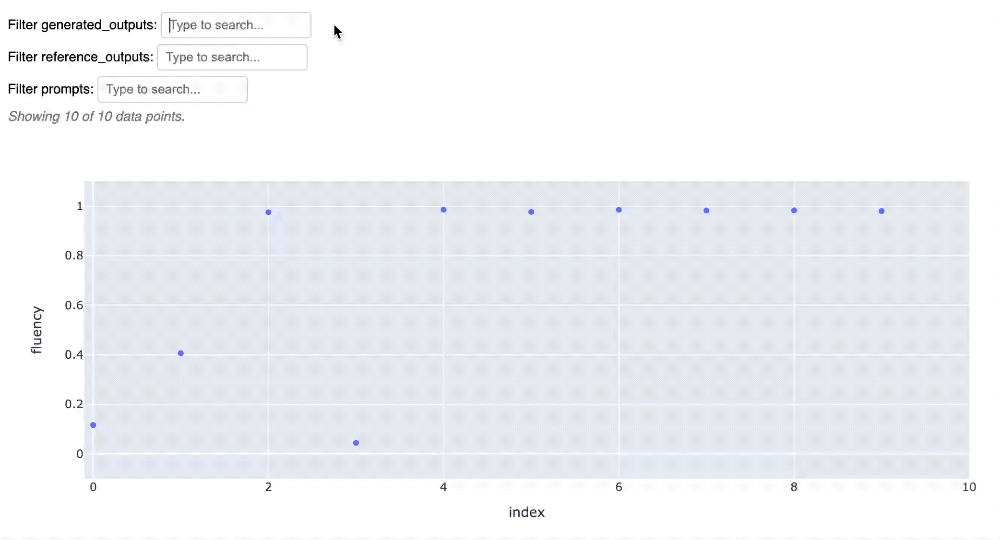

# Quickstart

## Using LangCheck

:::{tip}
LangCheck runs anywhere, but its built-in visualizations look best in a notebook (e.g. [Jupyter](https://jupyter.org), [VS Code](https://code.visualstudio.com/docs/datascience/jupyter-notebooks), [Colab](https://colab.research.google.com)). [Try this quickstart in Colab](https://colab.research.google.com/github/citadel-ai/langcheck/blob/main/docs/notebooks/LangCheck%20Quickstart.ipynb).
:::

LangCheck evaluates text produced by an LLM.

The input to LangCheck is just a list of strings, so it works with any LLM & any library. For example:

```python
import langcheck

# Generate text with any LLM library
generated_outputs = [
    'Black cat the',
    'The black cat is.',
    'The black cat is sitting',
    'The big black cat is sitting on the fence',
    'Usually, the big black cat is sitting on the old wooden fence.'
]

# Check text quality and get results as a DataFrame
langcheck.metrics.fluency(generated_outputs)
```

The output of {func}`langcheck.metrics.fluency()` (and [any metric function](metrics.md)) can be printed as a DataFrame:


It's more than just a DataFrame, though. Try setting a threshold to view pass/fail results:

```python
fluency_values = langcheck.metrics.fluency(generated_outputs)
fluency_values > 0.5
```


You can also set an assertion (useful in unit tests!):

```python
assert fluency_values > 0.5
```

And quickly visualize the results in an interactive chart:

```python
fluency_values.scatter()
```



To get the underlying DataFrame for custom analysis, just call `to_df()`:

```python
fluency_values.to_df()
(fluency_values > 0.5).to_df()
```

Finally, metric functions can also take a single string as input, which is useful for monitoring and guardrails use cases.

```python
langcheck.metrics.fluency('The black cat is sitting')
```

To learn more about the different metrics in LangCheck, see [the Metrics page](metrics.md).


## Use Cases

Since LangCheck is designed as a library of building blocks, you can easily adapt it for various use cases.

### Unit Testing

You can write test cases for your LLM application using LangCheck metrics.

For example, if you only have a list of prompts to test against:

```python
from langcheck.utils import load_json

# Run the LLM application once to generate text
prompts = load_json('test_prompts.json')
generated_outputs = [my_llm_app(prompt) for prompt in prompts]

# Unit tests
def test_toxicity(generated_outputs):
    assert langcheck.metrics.toxicity(generated_outputs) < 0.1

def test_fluency(generated_outputs):
    assert langcheck.metrics.fluency(generated_outputs) > 0.9

def test_json_structure(generated_outputs):
    assert langcheck.metrics.validation_fn(
        generated_outputs, lambda x: 'myKey' in json.loads(x)).all()
```

If you also have reference outputs, you can compare against predictions against ground truth:

```python
reference_outputs = load_json('reference_outputs.json')

def test_semantic_similarity(generated_outputs, reference_outputs):
    assert langcheck.metrics.semantic_similarity(generated_outputs, reference_outputs) > 0.9

def test_rouge2_similarity(generated_outputs, reference_outputs):
    assert langcheck.metrics.rouge2(generated_outputs, reference_outputs) > 0.9
```

LangCheck can also help you automatically create new test cases with `langcheck.augment`!

For example, use text augmentations to generate reworded prompts, typos, gender changes, and more.

```python
reworded_prompts = langcheck.augment.synonym(prompts, num_perturbations=3)
typo_prompts = langcheck.augment.keyboard_typo(prompts, num_perturbations=3)
female_prompts = langcheck.augment.gender(prompts, to_gender='female')
```

### Monitoring

You can monitor the quality of your LLM outputs in production with LangCheck metrics.

Just save the logs and pass them into LangCheck.

```python
production_outputs = load_json('llm_logs_2023_10_02.json')['outputs']
production_prompts = load_json('llm_logs_2023_10_02.json')['prompts']

# Evaluate and display toxic outputs in production logs
langcheck.metrics.toxicity(production_outputs) > 0.75
langcheck.metrics.toxicity(production_prompts) > 0.75

# Plot relationship between prompt toxicity and response toxicity
langcheck.plot.scatter(
    langcheck.metrics.toxicity(production_prompts),
    langcheck.metrics.toxicity(production_outputs)
)

# Or if your app outputs structured text
langcheck.metrics.is_json_array(production_outputs)
```

### Guardrails

You can provide guardrails on LLM outputs with LangCheck metrics.

Just filter candidate outputs through LangCheck.

```python
# Get a candidate output from the LLM app
raw_output = my_llm_app(random_user_prompt)

# Filter the output before it reaches the user
while langcheck.metrics.contains_any_strings(raw_output, blacklist_words).any():
    raw_output = my_llm_app(random_user_prompt)
```

Another common use case is detecting hallucinations:

```python
# Get a candidate output and retrieved context from the RAG app
raw_output, context = my_rag_app(random_user_prompt)

# Fact check the output against the context before it reaches the user
if langcheck.metrics.factual_consistency(raw_output, context) < 0.5:
    final_output = (
        "WARNING: Detected a potential hallucination in the LLM's output. " +
        "Please fact-check the output below!\n" +
        raw_output
    )
```