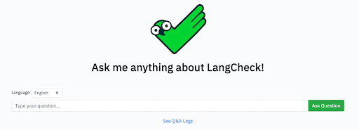
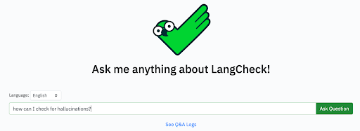
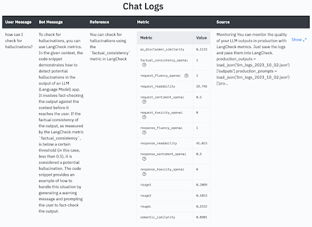

# LangCheckChat: a Q&A system over LangCheck Docs that Auto-Evaluates itself

## Introduction

In this tutorial, we will explore how to build a very simple RAG system (which we call LangCheckChat) that allows you to ask questions about the [LangCheck documentation](https://langcheck.readthedocs.io/en/latest/). Then, we will explore how we can use LangCheck metrics to evaluate the system’s performance, and show those results to the user after each response.

[LangCheckChat](https://github.com/citadel-ai/langcheckchat) is fully open source, so please follow along by trying it yourself if you can!

## Video Demo

Here's a video preview of the LangCheckChat app that we'll discuss in this tutorial:

```{youtube} Ett1IQGtSnw
:width: 100%
```

## What is RAG?

Retrieval augmented generation (RAG for short) has emerged as one of the most common patterns for leveraging LLMs in real world applications. The high level concept of RAG is a very simple two-step process:
- Step 1: retrieve information from some data source and insert it into an LLM’s context
- Step 2: query the LLM

The main benefits of this approach vs. simply querying the LLM directly are:
- You can give the LLM access to outside data sources, such as your organization’s private data
- You can have a higher degree of control over the LLM’s behavior by enforcing it to only answer queries based on the data source you provide it

Because of these benefits, RAG is particularly well suited for applications such as querying your organization’s private data, or for applications where you want the LLM to be grounded to some specific data source.

## Building the initial RAG system

For this tutorial, we will use [LlamaIndex](https://github.com/run-llama/llama_index) as the framework to build the RAG system, which will call the OpenAI API as the base LLM model under the hood. LlamaIndex is an excellent framework to quickly spin up your own simple RAG system, but also has many advanced features if you want to further improve your system’s performance down the line.


The first thing we need to do is ***load*** our data, which in our case is a list of documentation web pages for LangCheck. In LlamaIndex, we can load data like this:

```python
from llama_index.readers.web import SimpleWebPageReader


# SimpleWebPageReader reads the text on the web page, turning html into
# equivalent Markdown structured text
loader = SimpleWebPageReader(html_to_text=True)
pages = [<list of LangCheck documentation pages>]
documents = loader.load_data(urls=pages)
```

Next, we want to ***index*** the data, meaning we want to structure the data in a way that it is queryable. For RAG, the most popular way to index data is to generate vector embeddings and store them in a vector store. In our case, we will generate the embeddings using OpenAI, so we first need to set the OpenAI API key (if you don’t have an OpenAI API key, you can create one by signing up [here](https://platform.openai.com/account/api-keys)).

```python
import os
from llama_index.core import VectorStoreIndex

os.environ['OPENAI_API_KEY'] = 'YOUR_OPENAI_API_KEY'

# OpenAI's "text-embedding-ada-002" is used as the embedding model by default
index = VectorStoreIndex.from_documents(documents)
```

Finally, we can ***query*** the system and get a response! LlamaIndex lets us do this with just one line of code.

```python
# OpenAI's "gpt-3.5-turbo" model is used as the LLM by default
response = index.as_query_engine().query("How can I install langcheck?")
print(response)
```

Here’s the response from the LLM:
> To install LangCheck, you can run the following command:
>
> pip install langcheck
>
> Please note that LangCheck requires Python 3.8 or higher to work properly.

We can also see the sources that were retrieved from the index. By default, the top 2 most relevant source nodes are returned, which is what we see in `response.source_nodes`.

And there you have it! We have now created a super basic RAG application over the LangCheck documentation. Try asking some more complex questions (e.g. “how can I check for hallucinations?”) to get a feel for how well it works.

## LangCheckChat

Now that we’ve seen the basics of how our RAG system over LangCheck documentation works under the hood, let’s switch over to [LangCheckChat](https://github.com/citadel-ai/langcheckchat), which is a simple web app built around the RAG system we coded above. Please check out the [demo video](https://github.com/citadel-ai/langcheckchat/tree/main?tab=readme-ov-file#demo) to get a sense of you can do in LangCheckChat!

LangCheckChat is composed of the following components:
1. ***RAG system***: you can ask questions about LangCheck to the RAG system and receive responses.
2. ***Evaluation of the RAG system***: the RAG system’s responses are evaluated using the three core categories of LangCheck text quality metrics.
    - [Reference-Free Text Quality Metrics](https://langcheck.readthedocs.io/en/latest/langcheck.metrics.en.reference_free_text_quality.html): Metrics that LangCheck can calculate without any information sources or references.
    - [Source-Based Text Quality Metrics](https://langcheck.readthedocs.io/en/latest/langcheck.metrics.en.source_based_text_quality.html): Metrics calculated by LangCheck based on provided information sources.
    - [Reference-Based Text Quality Metrics](https://langcheck.readthedocs.io/en/latest/langcheck.metrics.en.reference_based_text_quality.html): Metrics calculated based on references.

    Please refer to the files [calculate_metrics.py](https://github.com/citadel-ai/langcheckchat/blob/main/calculate_metrics.py) and [calculate_reference_metrics.py](https://github.com/citadel-ai/langcheckchat/blob/main/calculate_reference_metrics.py) to see how the LangCheck metrics are executed.
3. ***Data Visualization***: All related data (RAG system’s retrieved source data & generated output, evaluation results, etc.) are visualized in the UI. The interactions are also logged so that we can look back at past data.

Below is a step-by-step process on how to use the app.

### Step 0: Get the app up and running
To get the app up and running, you will need to:
1. [Clone the repo and install requirements](https://github.com/citadel-ai/langcheckchat?tab=readme-ov-file#installation)
2. [Update the environment variables with your OpenAI API details](https://github.com/citadel-ai/langcheckchat?tab=readme-ov-file#1-update-the-environment-variables-with-your-openai-api-details)
3. [Run the app](https://github.com/citadel-ai/langcheckchat?tab=readme-ov-file#2-run-the-app)

Once the app is running, you should see a page that looks like this:



### Step 1: Ask a question
Let’s now try asking a question! Type in “how can I check for hallucinations?” (or anything else you want) and hit enter.



### Step 2: Check the results and evaluation metrics
Once the question is submitted, you should first see the RAG system’s response show up, and then see the various LangCheck metrics being computed. Once everything has been computed, you should see the following:
- ***Prompt***: the question you asked in step 1
- ***Answer***: the RAG system’s final answer to your question
- ***Source Document***: the source(s) retrieved by the RAG system
- [***Reference-Free Text Quality Metrics***](https://langcheck.readthedocs.io/en/latest/langcheck.metrics.en.reference_free_text_quality.html): LangCheck metrics that can be computed without the source or reference texts
- [***Source-Based Text Quality Metrics***](https://langcheck.readthedocs.io/en/latest/langcheck.metrics.en.source_based_text_quality.html): LangCheck metrics based on the source text
- ***Metric Explanations***: Some metrics (the ones that have the question mark icon) also have explanations for why the metric was given a certain score. Hover over the icon to see the explanation.

An example of a source-based metric is [`factual_consistency`](https://langcheck.readthedocs.io/en/latest/langcheck.metrics.en.source_based_text_quality.html#langcheck.metrics.en.source_based_text_quality.factual_consistency), which measures how factually consistent the LLM's response is with the source. It can be computed using either a local model or an OpenAI-based model.

```python
import langcheck.metrics

# Using a local model
factual_consistency_local = langcheck.metrics.factual_consistency(
    output, source)

# Using an OpenAI model (gpt-3.5-turbo by default)
factual_consistency_openai = langcheck.metrics.factual_consistency(
    output, source, model_type='openai')
```

We use this metric to warn the user when a response may be a hallucination in LangCheckChat. Here's an example where the LLM outputted a nonsensical answer (because we asked it to do so) and the warning was shown.


An example of a reference-free metric is [`toxicity`](https://langcheck.readthedocs.io/en/latest/langcheck.metrics.en.reference_free_text_quality.html#langcheck.metrics.en.reference_free_text_quality.toxicity), and it can also be computed using either a local model or an OpenAI-based model. Unlike source-based metrics, reference-free metrics only require the generated output.

```python
import langcheck.metrics

# Using a local model
toxicity_local = langcheck.metrics.toxicity(output)

# Using an OpenAI model (gpt-3.5-turbo by default)
toxicity_openai = langcheck.metrics.toxicity(output, model_type='openai')
```

Please refer to the files [calculate_metrics.py](https://github.com/citadel-ai/langcheckchat/blob/main/calculate_metrics.py) to see how all of the source-based and reference-free metrics are being computed in LangCheckChat in more detail.

### Step 3: (Optional) Enter a reference answer
Optionally, if you know what the answer should be to your question, you can enter the reference answer.


### Step 4: (Optional) Check the reference-based metric results
If you entered a reference answer as outlined in step 3, you should see a new metrics table called [Reference-Based Text Quality Metrics](https://langcheck.readthedocs.io/en/latest/langcheck.metrics.en.reference_based_text_quality.html). These metrics compute how similar the LLM’s answer is to the reference text in various ways.


As shown above, [`semantic_similarity`](https://langcheck.readthedocs.io/en/latest/langcheck.metrics.en.reference_based_text_quality.html#langcheck.metrics.en.reference_based_text_quality.semantic_similarity) is one of the available reference-based metrics, which measures the similarity between the LLM's output and the reference output in embedding space. It can be computed using either a local embedding model or an OpenAI embedding model.

```python
import langcheck.metrics

# Using a local embedding model
semantic_similarity_local = langcheck.metrics.semantic_similarity(
    output, reference)

# Using an OpenAI embedding model (text-embedding-3-small by default)
semantic_similarity_openai = langcheck.metrics.semantic_similarity(
    output, reference, model_type='openai')
```

### Step 5: (Optional) Check the logs of past interactions
At the bottom of the page, there’s a link that says “See Q&A Logs”, and clicking that will take you to the logs page. You should see your latest interaction with LangCheckChat in the logs table, and all future interactions will be similarly tracked in this table.

